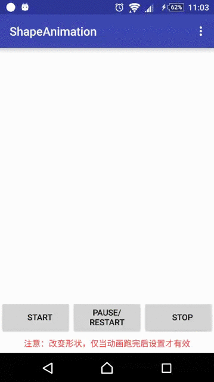
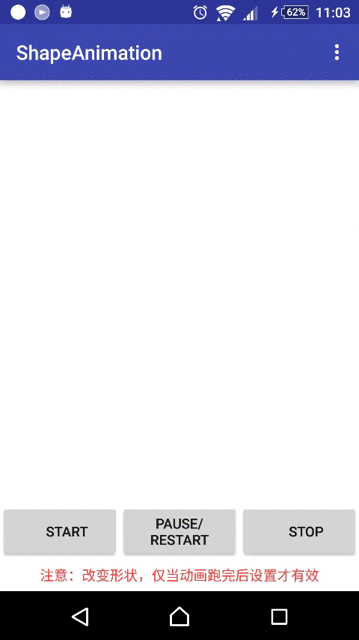
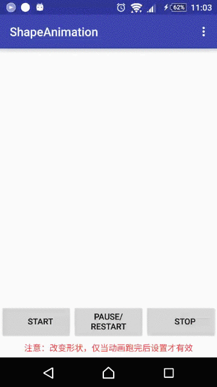

# ShapeAnimation
### 整理之前项目中的一个帧动画实现，用SurfaceView实现并添加多种状态控制，效果上仅添加简单的从中心点扩展演变和透明度变化！

#### 欢迎大家下载体验或提供更好的效果实现

## 演示

## 实现原理
ShapeAnimationView继承自SufaceView，使用DrawThread和Canvas绘制界面！
通过开启、暂停、停止、销毁等状态控制动画显示，这里既有停止又有销毁，是为了防止重复创建View，仅需复用View通过改变参数得到不同形状的动画呈现！
另外就是对于shape.XML文件的解析，所有的Shape都是通过在720*1280屏幕上描点绘制！PullParse解析得到描点数据后获取中心点和极值得到所有的有中心扩展演变的数据模型！

## 使用注意事项
Shape切换需要等上一个动画效果跑完后即state置为stop状态后才能够切换成功得到设置后的效果！

## 改进和期待
这个效果实现很久了，一直没有整理！之前在[codepen.io](http://codepen.io/)上看到过一个用JS实现的更酷炫动画（遗憾未找到链接地址）：不用绘制已有的效果，直接输入英文语句即可得到如同ShapeAnimation类似的酷炫动画来呈现这条语句！这或许就是当前项目改进方向，省去xml文件绘制，直接由用户输入得到效果！

License
=======

    Copyright (C) 2016 Leone90

    Licensed under the Apache License, Version 2.0 (the "License");
    you may not use this file except in compliance with the License.
    You may obtain a copy of the License at

       http://www.apache.org/licenses/LICENSE-2.0

    Unless required by applicable law or agreed to in writing, software
    distributed under the License is distributed on an "AS IS" BASIS,
    WITHOUT WARRANTIES OR CONDITIONS OF ANY KIND, either express or implied.
    See the License for the specific language governing permissions and
    limitations under the License.
